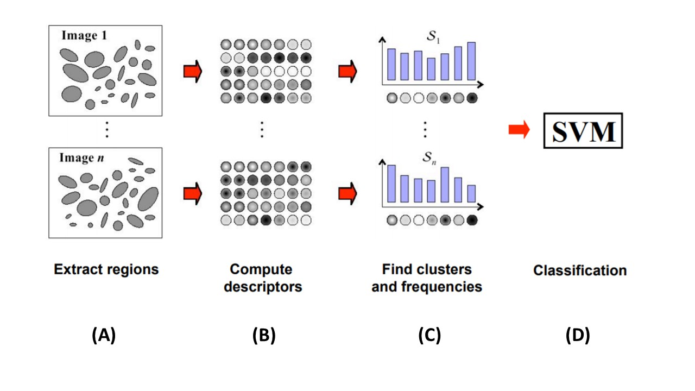

```{r setup, include=FALSE}

####################################################
# Course : STAT 503
# File: Final Project
# Author: Yung-Chun LEE, Aman Taxali
####################################################

############
# settings #
############
library(tidyverse)
library(latex2exp)
library(ggplot2)
library(knitr)
library(MASS)
library(GGally)
library(grid)
library(gridExtra)
library(latex2exp)
setwd("C:/Users/user/Desktop/Umich Stat/2018 Winter/STAT 503/Project")
knitr::opts_chunk$set(echo = FALSE)
```


##Problem of Interest 

Images have played a great part of our life after dat storage become cheaper and convenient in the 21st century. In 2001, Google enable users to search image with a 250 millions of images, and the data base has grown exponentially ever since its launch. Within a decade, Reverse image search[content-based image retrieval(CBIR)] was introduced. The importance of image recognition and automated image classification has become popular over time. Even though the concept of neural network was first introduced back in 1940s, computors was not available nor able to undertake massive calculation when it was first introduced, but nowadays we are able to compute complicated models and algorithmns such as Convolutional Neural Network(CNN), Deep Neural Network(DNN) ,...etc. Popular algorithmns were introduced to solve the image classification problems. 

###Data Exploration Challenge with Image data/ Difference with tabular data

*Color digital images are made of pixels, and pixels are made of combinations of primary colors represented by a series of code. A channel in this context is the grayscale image of the same size as a color image, made of just one of these primary colors. For instance, an image from a standard digital camera will have a red, green and blue channel.* 

####Data Structure

A color digital image can be decompose into an 3-dimensional array with each a $n$ by $m$ matrix *(or a $nm$ length vector)*, which each matrix *(vector)* correspond to a specific channel **R,G,and B**.

####Properties

+ Ordered/ Not exchangable

Even the data storage is tabular, but the columns are not exchangable, and pixels cells are highly correlated with each other.

+ Scale 

+ Rotation

+ Noise 


## Naïve Classifier - **Nearest Neighbor Classifier**

###Introduction

First, we start with a naïve classifier which only consider the distance of the two matrices, the prediction of the test data is solely decided by the closet neighbor it can find among the training data space, we picked **L-1 norm** and **L-2 norm** for the disatnce calculation process. 

+ 
$$
||M||_1 = max_{1 \leq j \leq m} \sum_{i=1}^{m} |m_{ij}|
$$

Which is the maximum absolute column sum of the matrix.

+
$$
||M||_2 = \sigma_{max}(M) \leq \Bigg(  \sum_{i=1}^{n} \sum_{j=1}^{m} |m_{ij}|^2\Bigg) ^{1/2}
$$
where $\sigma_{max}(M)$ is the maximun singular value of matrix $M$.

###Algorithm 

Suppose we have a test image, say $M_{test}$ and set of training imgaes $M_{train_1},M_{train_2},\cdots,M_{train_n}$with known class labels

+ First calculate the matrix difference of the test image $M_{test}$ with **ALL** training images $M_{train_1},M_{train_2},\cdots,M_{train_n}$, the difference of any two matrices is definded as the element-wise substraction, i.e. 

$$
\begin{split}
A_{m\times n} - B_{m \times n} 
&=
\begin{bmatrix}
a_{11} && \cdots && a_{1n} \\
\vdots && \ddots && \vdots \\
a_{m1} && \cdots && a_{mn} \\
\end{bmatrix}
-
\begin{bmatrix}
b_{11} && \cdots && b_{1n} \\
\vdots && \ddots && \vdots \\
b_{m1} && \cdots && b_{mn} \\
\end{bmatrix} \\
&=
\begin{bmatrix}
a_{11}-b_{11} && \cdots && a_{1n}-b_{1n} \\
\vdots && \ddots && \vdots \\
a_{m1}-b_{m1} && \cdots && a_{mn}-b_{mn} \\
\end{bmatrix} =M_{m \times n}
\end{split}
$$

+ Second, we calculate the choose of *L-1 norm/L-2 norm* distance of the matrix from previous step.
+ The prediction is made by comparing all *L-1/L-2* distances of the target test data to be classified, such that the predicted class is the one with minimun distance, i,e

$$
\hat{Y_{Test}} = \Bigg\{N \in \{Class~of~||M_i||_{p}\}; ||M_i||_{p} =min\Big\{ ||M_1||_{p},\cdots,||M_m||_{p} \Big\} \Bigg\}, \text{where }p \text{ denotes } L_p \text {distance}
$$

####Pseudo Code


####Data experiement

From the MNIST hand writting data set, we selected: 
+ Training Set: First 100 observations per class (0-9), total of 1000 observations. 
+ Test Set: First 10 observations per class (0-9), total of 100 observations. 

The result from the test data (consist of 100 observations per class):

```{r}
#source class_heatmap function
source('./class_heatmap.R')

#load plot data 
load("./Data/nn_low_res.RData")

##description of figure
mnist_desc =substitute (paste(italic("Notes:") ,
                              "Err denotes the misclassified count frequency."))
#plot images

L1_mnist_plt = class_heatmap(L1_df,"Using L1-norm")
L2_mnist_plt = class_heatmap(L2_df,"Using L2-norm")
grid.arrange(L1_mnist_plt,L2_mnist_plt,ncol=2,
             top = textGrob(substitute(paste("Heatmap of classification matrix with ",
                                             italic('Low-resolution'), " images")),
                            x = 0, # starts far left
                            y = 0.5, # experiment with
                                     # vertical placement
                            just = "left", # left-aligned,
                            gp = gpar(fontsize = 16)),
             bottom = textGrob(  mnist_desc,
                                 x = 0, # starts far left
                                 y = 0.5, # experiment with
                                     # vertical placement
                                 just = "left", # left-aligned,
                                 gp = gpar(fontsize = 10)))
```

####L1 vs. L2.


##Introducing Feature Descriptors

**TODO: Describe what a feature detector is. **

###Histogram of Gradient (HOG)

**TODO: Explain histogram of gradient**
**TODO: Discuss HOG on low- and high- resolution data set.**

###PCA of Histogtam of gradient(HOG) 

**TODO: Explain model**
**TODO: pseudo code** 
**TODO: low/high res classification matrix**
**TODO: Interpret result**

###Bag of Feature 

**TODO: Flow chart**



*Image credit (BOF Flow Chart): Image adapted from Arénaire project, Laboratoire de l'Informatique du Parallélisme(LIP)*

**TODO: Explain model using flow chart**

+ **Step (A)**: 

+ **Step (B)**: 

+ **Step (C)**: 

+ **Step (D)**: 

**TODO: Pseudo code**

###BoF with HOG

**TODO: Explain BoF with HOG**

**TODO: BoF with HOG, high-/low- classification matrix** 

**TODO: Bof with HOG interpret result**

###SIFT

**TODO: Introduce SIFT** 

###BoF with SIFT

**TODO: Explain BoF with SIFT**

**TODO: BoF with SIFT, high-/low- classification matrix** 

**TODO: Bof with SIFT interpret result**

###Feature Descriptors + SVM 

**TODO: flow chart**

**TODO: HOG + SVM**

**TODO: HOG + SVM, high-/low- classification matrix** 

**TODO: HOG + SVM interpret result**

\newpage

##Appendix
 
```{r, ref.label=knitr::all_labels(),echo=TRUE,eval=FALSE}
```